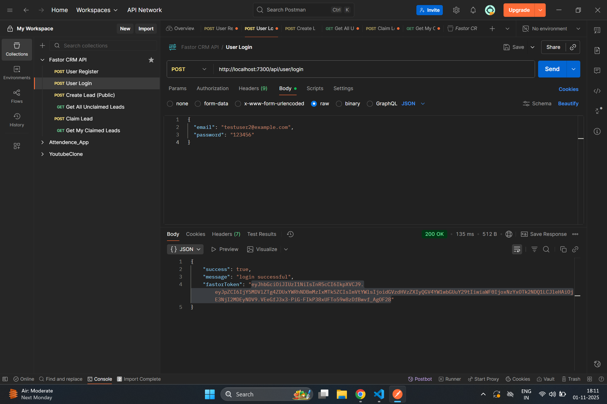
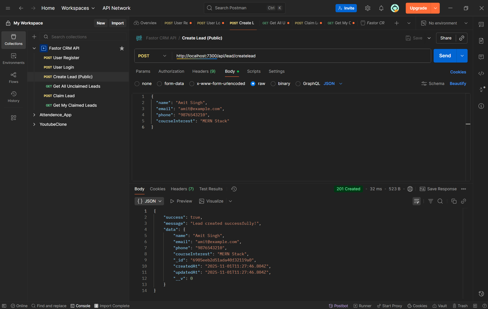
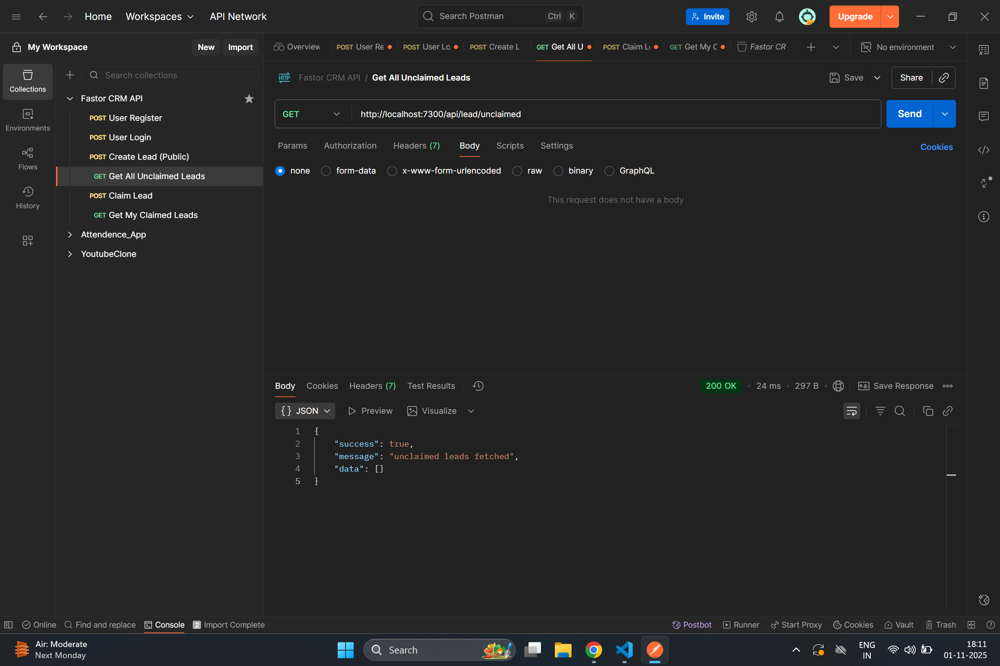

# 🧾 Fastor CRM Backend

A lightweight **CRM backend** built using **Node.js, Express, and MongoDB**.  
Implements user authentication and lead management — create, view, and claim leads — as per the Fastor Node.js Developer assignment.

---

## 📸 Screenshots

<div align="center" style="display: flex; flex-wrap: wrap; justify-content: center; gap: 20px; margin-bottom: 40px;">
  
  
</div>

<br><br>

<div align="center" style="display: flex; flex-wrap: wrap; justify-content: center; gap: 20px; margin-bottom: 40px;">
  
  
</div>

<br><br>

<div align="center" style="display: flex; flex-wrap: wrap; justify-content: center; gap: 20px; margin-bottom: 40px;">
  
  
</div>

---

## 🛠️ Tech Stack

- **Backend:** Node.js, Express.js, Mongoose
- **Authentication:** JWT, bcryptjs
- **Database:** MongoDB Atlas
- **Environment Management:** dotenv
- **Testing Tool:** Postman

---

## ⚙️ Installation Guide

1. **Clone the Repository**

   ```bash
   git clone https://github.com/your-username/fastorCrmBackend.git
   cd fastorCrmBackend
   npm install

   ```

2. **Add env file **

   ```.env
   PORT=7300
   MONGODB_URI=your_mongodb_connection_string
   JWT_SECRET=your_secret_key

   ```

3. **Start the server**

   ```bash
   npm run dev
   ```

4. **Postman Collection**
   A ready-to-use Postman collection is available in the /postman folder:
   postman/FastorCRM.postman_collection.json
   <br>
   It includes all endpoints with placeholders and examples, so anyone can easily test:
   <br>
   Token: from login response (fastorToken)
   <br>
   Lead Id: from unclaimed leads response

## 📫 Contact

- GitHub: [safeer997](https://github.com/safeer997)
- Email: safeeralam997@gmail.com

```

```
